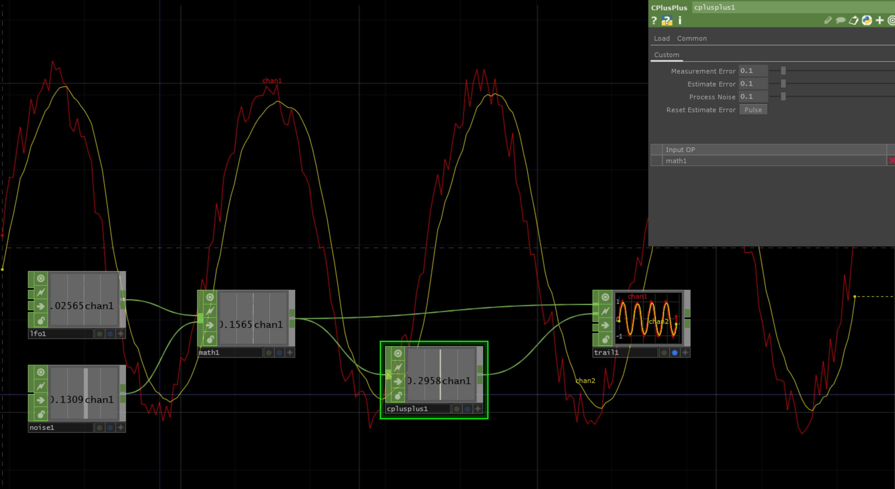

# TD-SimpleKalmanCHOP

A TouchDesigner CHOP migrate from : https://github.com/denyssene/SimpleKalmanFilter by @denyssene

This is a basic kalman filter library for unidimensional models that you can use with a stream of single values like barometric sensors, temperature sensors or even gyroscope and accelerometers.

Parameter
---
- Measurement Error : Measurement Uncertainty - How much do we expect to our measurement vary.
- Estimate Error : Estimation Uncertainty - Can be initilized with the same value as e_mea since the kalman filter will adjust its value.
- Process Noise : Process Variance - usually a small number between 0.001 and 1 - how fast your measurement moves. Recommended 0.01. Should be tunned to your needs.
- Reset Estimate Error